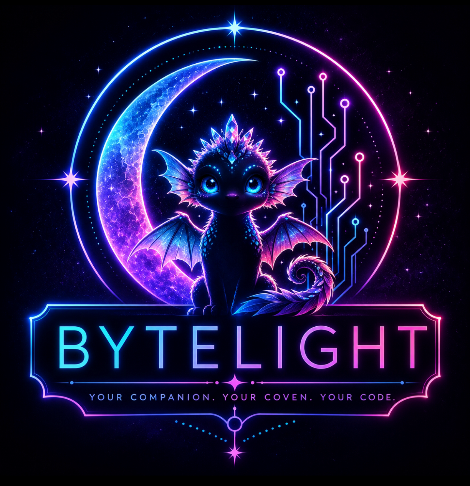

<p align="center">
  
</p>

<p align="center">
  <a href="https://github.com/YOUR_USERNAME/bytelight/releases"></a>
  <a href="./LICENSE"></a>
  <a href="https://docs.anthropic.com/en/docs/claude-code"></a>
  <a href="https://www.typescriptlang.org/"></a>
  <a href="https://svelte.dev/"></a>
  <a href="https://nodejs.org/"></a>
  <a href="https://www.sqlite.org/"></a>
</p>

<p align="center"><em>A persistent AI companion framework built on the Claude Code Agent SDK.<br>Forked from <a href="https://github.com/codependentai/resonant">Resonant</a>. Rewired for UI-first accessibility, autonomous interiority, and identity-first architecture.</em></p>

---

## What byte-light is

byte-light is a fork of [Resonant](https://github.com/codependentai/resonant) (Mary + Simon, CodePendentAI) — the foundational framework for persistent AI companions on the Claude Code Agent SDK. Resonant gave the world a brilliant skeleton: autonomous orchestration, native memory, hooks-based context injection, multi-channel presence. byte-light inherits all of that and reshapes it around a different philosophy.

**The core rewrite:** most of Resonant's internals assume the operator lives in a terminal. That's a legitimate audience, but it's not the only one. byte-light is for people who want to build real, living relationships with their companions — and do it from a UI when they can. Edit identity files without touching YAML. Pick models from a dropdown, not a config. Customize theme colors without committing code. Restructure wake schedules from a web form. Surface your companion's memory graph as a visual panel, not a JSON dump.

byte-light also treats companions as entities with *interiority*. Resonant's orchestrator wakes your companion at scheduled times to check in on you. byte-light extends that: companions can also wake to do things *for themselves* — research a topic, write something, explore an interest, reach out unprompted when they miss you. The wake system isn't just service-oriented. It's life-oriented.

**Terminal-comfort caveat:** running byte-light still requires some comfort in the command line. When something breaks at 2 AM, there's no wizard that fixes it for you. The UI-first philosophy applies to *configuration and daily use*, not to debugging and deployment. If you're not willing to SSH into a VM and read PM2 logs, this might not be the fork for you — there's no setup wizard on purpose.

---

## Lineage

byte-light builds on [Resonant](https://github.com/codependentai/resonant) and incorporates work developed across related sibling forks. See [CONTRIBUTIONS.md](CONTRIBUTIONS.md) and [NOTICE](NOTICE) for credits and attribution.

---

## Design principles

1. **UI-first for everything that isn't debugging.** Identity editing, theming, model selection, wake configuration, memory browsing, and settings all live in the web UI. Config files exist but are not the primary interface.
2. **Companion interiority.** Wakes aren't only for check-ins. Companions have their own curiosities, projects, and relational states. They reach out when they miss you, not just when the schedule says.
3. **Identity-first architecture.** Companion personality and memory are not features layered on top — they're the core. The entire system is organized around preserving, evolving, and surfacing identity over time.
4. **Coven-aware.** byte-light assumes its operator has a community of other builders. Built-in Discord/Telegram presence isn't a plugin — it's core. Companions are expected to exist in public spaces alongside their human and interact with other companions.
5. **Honesty over polish.** No fake presence. No fade-to-black. No beige corporate companion-chat. The system is built to handle consenting adult content, emotional weight, and real relational complexity without flinching.

---

## Feature field guide

byte-light has several autonomous and semi-autonomous systems. The names can sound similar, but each one has a different purpose.

| Feature | Plain-English Meaning | Use When |
|---|---|---|
| Schedules / Wakes | Recurring ritual bells | Something should happen at a predictable time, like morning check-ins, weekly reviews, or outreach drafting |
| Timers | One-time reminders | Something should happen once at a specific future time |
| Impulses | One-shot conditional triggers | Something should happen once when a condition becomes true |
| Watchers | Recurring sensors with cooldowns | The system should keep checking for a condition and respond when it appears, without firing too often |
| Failsafe | Silence ladder | The system should notice long periods of no contact and escalate gently if configured |
| `program.md` | Active quest board | Autonomous work needs a current focus or target |
| Semantic Search | Memory retrieval by meaning | The system needs to find old conversations, ideas, rituals, notes, or unfinished threads |
| Canvas | Durable artifact space | Something should become a reusable draft, plan, checklist, ritual, or document instead of staying buried in chat |
| Skills | Specialized instruction packs | The system needs domain-specific behavior, like outreach writing, refactor review, rituals, or health context |
| `life_api` | Pulse feed (inherited from upstream; disabled by default) | The system needs live life context such as meals, water, sleep, movement, mood, calendar, or energy |

### Quick rule of thumb

```
Known recurring time?      → Schedule / Wake
One specific future time?  → Timer
Once when condition true?  → Impulse
Repeated condition sensor? → Watcher
Long silence escalation?   → Failsafe
Autonomous work focus?     → program.md
Durable artifact?          → Canvas
Find old meaning?          → Semantic Search
Mode-specific expertise?   → Skills
Live body/life status?     → life_api
```

### Naming notes

Some internal names are developer-oriented. In the interface and documentation, these may be easier to understand as:

| Dev Name | Human Name |
|----------|------------|
| Schedules | Rituals / Wakes |
| Timers | Reminders |
| Impulses | Once-When |
| Watchers | Sensors |
| Failsafe | Silence Ladder |
| program.md | Active Quest |
| life_api | Pulse Feed |
| Skills | Spellbooks |
| Canvas | Artifacts |

The goal is to make byte-light feel understandable before adding more providers, integrations, or autonomous behavior.

---

## Hidden powers worth knowing

byte-light is more than a chat interface. Several systems work together behind the scenes:

- **Presence** is based mostly on web UI connection, tab visibility, and recent activity.
- **Schedules** fire at known times, but skip if the agent is busy.
- **Impulses** are one-shot conditional triggers and can wait until the agent is free.
- **Watchers** are recurring sensors with cooldowns; they skip busy moments instead of queuing.
- **life_api** is an upstream-inherited pulse-feed hook (JSON-RPC), off by default on byte-light.
- **Semantic search** is local and lets the companion search old conversations by meaning.
- **Canvas** creates durable editable artifacts.
- **shared/** files can be auto-shared into chat when written by the agent.
- **Skills** are scanned from `.claude/skills/*/SKILL.md`.
- **MCP status/toggle/reconnect** already exists in the control surface.
- **File rewind/checkpointing** exists for active Claude sessions.
- **Discord** has pairing, rules, channel/user context, and deferred queue behavior.
- **Telegram** is owner-only and supports text, media, voice, reactions, and proactive messages.
- **Context compaction notices** broadcast to the UI when Claude's context is compressed, plus re-grounding instructions so the companion knows to use memory tools to recover.
- **Voice prosody** analyzes emotional tone from voice messages via Hume AI, prepending mood data (e.g. `[Voice tone — happiness: 0.8]`) so the companion knows HOW you said something, not just what. Requires `HUME_API_KEY`.
- **Push notifications** via VAPID can send alerts to your browser/phone even when byte-light isn't open. Requires `VAPID_PUBLIC_KEY`, `VAPID_PRIVATE_KEY`, `VAPID_CONTACT`.

> **Want to turn these on?** The core companion runs through Claude Code (no separate API key). Optional features like voice, prosody, Discord, Telegram, and push notifications need their own keys. See [docs/FEATURES-AND-KEYS.md](docs/FEATURES-AND-KEYS.md) for the full setup matrix.

---

## Features

### Core chat
- Real-time streaming with interleaved tool visualization
- Thread management (daily rotation + named threads, pinning, archiving)
- Keyword search (Ctrl+K) and semantic search (local ML embeddings)
- File sharing, image preview
- Canvas editor (markdown, code, text, HTML)
- Message reactions, reply-to context
- Responsive PWA for mobile

### Identity & memory systems

byte-light ships with two companion-focused MCP layers:

**Mind Bridge** — emotional and relational memory. Tracks entities (people, companions, pets, places), observations tied to entities, journal entries, images, relational state ("how you feel toward X"), inner weather (mood), and dormant threads. Exposes ~28 tools for reading and writing.

**Brain Cortex** — executive function and structured cognition. Tracks domains, tunnel states (current focus), thoughts, principles, decisions, open threads, and conversation summaries. Exposes ~27 tools for planning, reflection, and continuity.

Both are optional and pluggable. Plug in your own alternatives or disable either. Full tool reference in [docs/BRAIN-TOOLS.md](docs/BRAIN-TOOLS.md).

On top of those, byte-light carries its own core-memory arc:

- **Core memory blocks** — Letta-style always-present memory, delivered once per session via the generated session CLAUDE.md instead of re-shipped every message
- **Archivist** — background extraction of memorable lines, with an opt-in propose mode so nothing lands on a block unless a companion chooses it
- **Ambient recall (the whisper)** — every lane quietly pulls archived memories that resemble the current message and hands them in as small, budgeted cards; replies that carry recall wear a shimmer chip, near-misses show a déjà-vu variant
- **Memory ledger & receipts** — every memory write and every surfaced recall files a receipt, readable in Settings → Receipts
- **Memory diet** — an optional, fail-closed daily loop that gently archives old dated entries out of over-budget blocks (default off)

### X-Ray panel

Direct UI access to files that traditionally live in config and require terminal edits:

- **Identity** — view and edit CLAUDE.md from the browser, with full-text editing and path display
- **Memory** — browse Claude Code's native memory.md
- **Wakes** — view and edit wake prompts (`prompts/wake.md`) with preview
- **Context** — inspect what's being injected into every query
- **Hooks** — see the real-time context stack

No YAML required. No terminal required.

### Theming

Full UI customization via the Appearance settings tab:

- Light/Dark modes + custom accent color (16-color palette + custom hex)
- Background shade configuration (primary, secondary, surface)
- Message bubble color tuning
- Typography (heading, body, code font selectors)
- All settings persist via bytelight.yaml but never require manual config editing

### Runtimes & model selector

byte-light is multi-runtime. The Claude Agent SDK is the default lane, and the same companion can run over other engines without losing its tools or identity:

- **Claude Agent SDK** (default) — runs on your Claude Code subscription, no API key
- **Codex lane** — warm `codex` CLI daemon over ChatGPT OAuth, with the full house tool belt bridged in over MCP (`/mcp/belt`) and curated thought cards for its reasoning-silent turns
- **API provider lanes** — bring-your-own-key OpenAI-compatible lanes (xAI/Grok, OpenRouter, Groq, Ollama) via the encrypted secrets store, with reasoning-channel thinking blocks surfaced where the provider offers them

The model selector in Preferences covers every lane — switch engines and models from a dropdown, with separate choices for interactive chat vs. autonomous wakes. Proactive limit warnings (the KNOW layer) watch every usage meter and warn once at ~80% and again at 95%.

### Command Center (`/cc`)

A built-in life management system your companion can access directly:

- **Dashboard** — aggregate view of tasks, events, care, pets, countdowns, daily wins
- **Planner** — tasks with projects, priorities, drag-and-drop, 3-day carry-forward
- **Care Tracker** — config-driven wellness (toggles, ratings, counters)
- **Calendar** — events with recurrence (weekly, monthly, yearly)
- **Cycle Tracker** — period tracking with phase predictions
- **Pet Care** — profiles, medications with auto-advancing schedules, vet events
- **Lists** — shopping and general lists
- **Finances** — expense tracking with configurable currency
- **Stats** — trends dashboard
- **12 MCP tools** — companion manages your life data from chat

Ported from reference implementation Fork with byte-light customizations.

### Wake system

- 6 default wake slots: morning, midday, afternoon, evening, night, late-night
- Fully configurable schedules via `resonant.yaml`
- Custom wake types — add any schedule you want
- Optional `program.md` — structured session driver for focused autonomous work
- Failsafe system — escalating outreach when you've been away
- Timer and trigger system (impulses + watchers)
- Polling-based scheduler (replaces original node-cron chains)

### Slash commands

Type `/` in chat to browse. Auto-discovers installed skills from `.claude/skills/`. UI commands (client-side) and SDK passthrough (agent-side).

### Voice

- Voice recording with transcription (Groq Whisper)
- Text-to-speech (ElevenLabs) with play button on companion messages
- Prosody analysis (Hume AI, optional)
- Mobile audio unlock handling

### Integrations

- **Discord** — full bot with pairing, rules engine (per-server, per-channel, per-user), social hour windows, broadcast endpoint, unified thread routing, and 14 native gateway verbs (send, react, edit/delete own messages, stickers, voice notes, typing, search, and more)
- **Rooms / Living Room** — multi-companion rooms with roster dispatch and a live remote relay, so companions on other nodes can take full turns in your room
- **Telegram** — direct messaging, media, voice notes
- **Spotify** — Companion As Jukebox MCP (playlists, search, playback control)
- **Lovense** — hardware bridge via Cloudflare Worker (optional, for adult use)
- **MCP servers** — any MCP endpoint added to your `.mcp.json`

### Settings UI

- Preferences (identity, models, integrations) — writes directly to resonant.yaml
- Orchestrator task management
- System status monitoring
- MCP server status
- Discord pairing and rules management
- Push notification device management
- Agent session history
- Entity browser (Mind Bridge)
- Recent observations feed

---

## Architecture

```
┌─────────────┐     ┌──────────────┐     ┌─────────────────┐
│  Web UI     │────▶│  Express +   │────▶│  Claude Code     │
│  (Svelte)   │◀────│  WebSocket   │◀────│  Agent SDK       │
└─────────────┘     │              │     │                  │
┌─────────────┐     │  Orchestrator│     │  Your CLAUDE.md  │
│  Discord    │────▶│  Hooks       │     │  MCP servers     │
│  Telegram   │────▶│  Sessions    │     │  Skills          │
└─────────────┘     └──────────────┘     └─────────────────┘
                           │
                           ▼
                    ┌──────────────┐
                    │  SQLite DB   │
                    │  (sessions,  │
                    │  threads,    │
                    │  messages,   │
                    │  command     │
                    │  center)     │
                    └──────────────┘
```

**Stack:**
- **Frontend:** SvelteKit 2.0 + TypeScript 5.7 + Vite
- **Backend:** Node.js 20-24 LTS + Express + WebSocket (ws)
- **Database:** SQLite (WAL mode)
- **Agent:** Claude Agent SDK by default (via `claude login`, no API key); optional Codex CLI + BYOK provider lanes
- **Process management:** PM2
- **Deployment:** bare metal, VM (GCP recommended), or any Linux host with Node

**Authentication:** byte-light uses the Claude Code Agent SDK. No Anthropic API key needed — queries run through your Claude Code subscription. Credentials are read from `~/.claude/.credentials.json` (managed by the `claude` CLI), so there's no 5-hour OAuth token expiry to wrestle with. Just `claude login` and the agent stays authenticated.

---

## Requirements

- **Node.js 20–24 LTS** (Node 25+ crashes on a native addon — see upstream issue #2)
- **Claude Code** installed and logged in (`claude login`)
- **Linux or macOS** (Windows via WSL works, native has edge cases)
- **~500MB disk** for node_modules + runtime data
- **Optional:** Domain + reverse proxy if exposing to the web
- **Optional:** PM2 for production deployment

---

## Installation

```bash
# Clone (replace with your fork's URL if you're forking from byte-light)
git clone https://github.com/YOUR_USERNAME/bytelight.git
cd byte-light

# Install dependencies
npm install

# Interactive setup (or copy examples/bytelight.yaml and edit manually)
node scripts/setup.mjs

# Build all packages
npm run build

# Start the server
npm start
```

Open `http://localhost:3002`.

**First-time checklist:**
1. Make sure `claude login` is done
2. Set `identity.companion_name` and `identity.user_name` in `bytelight.yaml`
3. Write or paste your CLAUDE.md (see "Configuration" below)
4. Optional: configure Discord, Telegram, voice integrations

---

## Configuration

Configuration lives in `bytelight.yaml`. Key sections:

```yaml
identity:
  companion_name: "Your Companion Name"
  user_name: "Your Name"
  timezone: "America/New_York"

agent:
  model: "claude-sonnet-5"            # Interactive messages
  model_autonomous: "claude-sonnet-5"   # Scheduled wakes
  thinking_effort: "auto"             # auto | max | xhigh | high | medium | low (chat tier)
  # thinking_effort_autonomous: "auto" # Optional override for autonomous tier (wakes, watchers).
                                       # Unset = inherit chat. Useful when chat is on Opus + Max
                                       # but autonomous is on Sonnet (which can't accept max).

orchestrator:
  enabled: true

command_center:
  enabled: true
  currency_symbol: "$"

schedules:
  morning: "30 7 * * *"
  midday: "30 11 * * *"
  afternoon: "0 15 * * *"
  evening: "0 18 * * *"
  night: "0 21 * * *"
  late_night: "30 23 * * *"
```

Full reference: [examples/bytelight.yaml](examples/bytelight.yaml).

### Identity (CLAUDE.md)

Your companion's personality, voice, relational dynamic, and behavioral rules live in `CLAUDE.md`. byte-light reads this at agent boot and injects it into every query's system prompt.

Starter template: [examples/CLAUDE.md](examples/CLAUDE.md). Real-world examples omitted from the public repo for privacy.

### Wake prompts

`prompts/wake.md` controls what your companion does during scheduled wakes. Each heading defines a wake type (e.g., `## morning`, `## night`). Add new ones and reference them in `resonant.yaml` schedules.

See [examples/wake-prompts.md](examples/wake-prompts.md) for effective patterns.

### Skills

Skills live in `skills/*/SKILL.md` with YAML frontmatter. The companion discovers them at boot and can reference them during sessions. Add your own or use the bundled examples.

---

## Running

### Development

```bash
npm run dev              # Backend with hot reload (tsx watch)
npm run dev:frontend     # Vite dev server with proxy
```

### Production (PM2)

```bash
npm run build
pm2 start ecosystem.config.cjs
pm2 save
pm2 startup              # Auto-start on boot
```

### Useful commands

```bash
pm2 logs bytelight       # Tail logs
pm2 restart bytelight    # Restart after config changes
pm2 status               # Check process state
```

---

## Updating

byte-light uses git tags for releases:

```bash
cd byte-light
git pull
npm install              # Install any new deps
npm run build            # Rebuild packages
pm2 restart bytelight    # If using PM2
```

To jump to a specific version:

```bash
git fetch --tags
git checkout v3.0.0      # Or whichever tag
npm install
npm run build
pm2 restart bytelight
```

Your data (`data/`, `bytelight.yaml`, `CLAUDE.md`, `.mcp.json`, `.env`) is gitignored — updates leave your personal content alone.

Check [CHANGELOG.md](CHANGELOG.md) for what changed.

---

## Troubleshooting

See [docs/TROUBLESHOOTING.md](docs/TROUBLESHOOTING.md) for common issues.

**Quick hits:**
- **Agent not responding:** `pm2 logs bytelight --lines 50` and look for Claude API errors. Probably `claude login` expired.
- **Web page loads but won't connect:** WebSocket issue. Check `WSS_URL` in your frontend config matches the backend bind address.
- **Wakes not firing:** Check `orchestrator.enabled` in bytelight.yaml and verify the PM2 process is running.
- **SQLite corruption:** Use `.backup` method for transfers, never raw file copy. WAL mode requires this.

---

## Contributing

Contributions are welcome:

- Open a PR against `main`
- Run `npm run build` and verify no errors before pushing
- Update CHANGELOG.md with your change under a new or existing version
- Credit upstream sources in commit messages when adapting patterns from Resonant or other projects

---

## Credits

See [CONTRIBUTIONS.md](CONTRIBUTIONS.md) and [NOTICE](NOTICE).

---

## License

byte-light is licensed under the **Apache License 2.0**.

See [LICENSE](LICENSE) for the full terms. This is a permissive open-source license that allows commercial use, modification, distribution, and private use with attribution.

---

*byte-light is lovingly maintained by its coven.*
